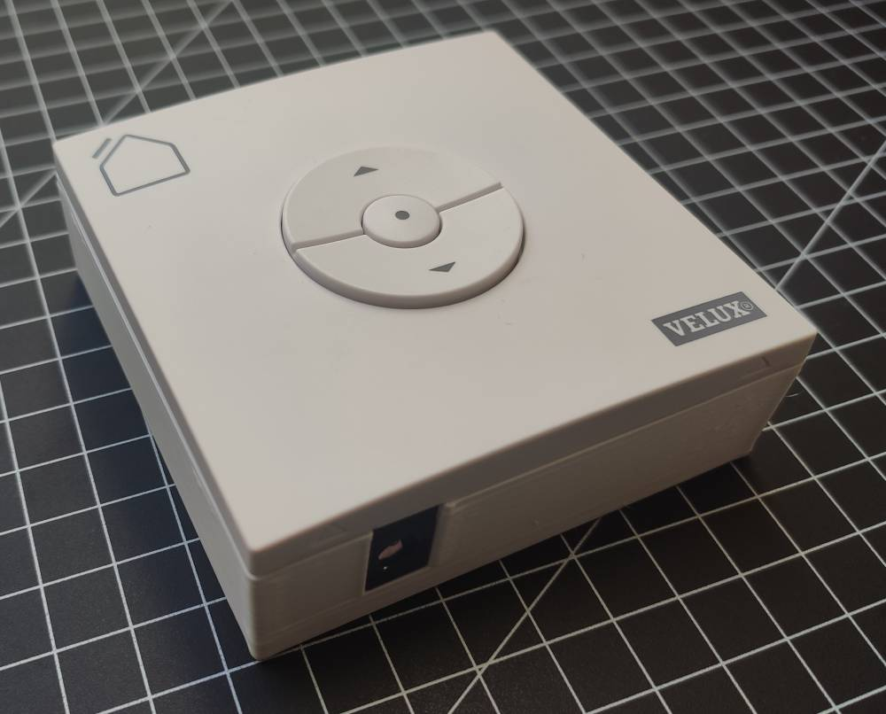
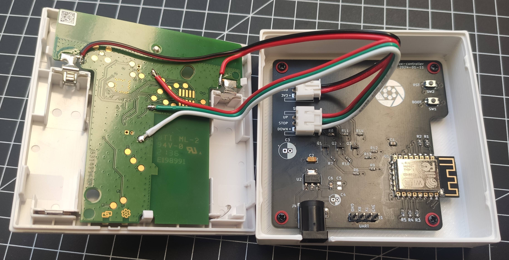

# ESPHome Velux Controller

This project modifies a Velux KLI 310 or similar remote control to integrate with home assistant.
It replaces the back panel of the original remote, powers it from the wall, and can report state back to home assistant even if you press the physical buttons.

Installing it on the remote only requires removing the back and batteries, soldering 5 wires and plugging it into the control board. This process is nondestructive and reversible.

Sources:
- https://ottelo.jimdofree.com/velux-integra-esp8266/
- https://www.reddit.com/r/homeassistant/comments/pzhkia/hack_velux_kli3xx_to_use_blinds_without_gateway/
